# 🌸 Flowery Driver App

A modern **Flutter Flowery application** built with Clean Architecture.  
The app allows driver to browse orders, add pick it up from store, and manage deliver it to user.

[](https://flutter.dev)
[](https://github.com/Aswani20/flowery-driver/stargazers)
[](https://github.com/Aswani20/flowery-driver/issues)
[](LICENSE)
[](https://github.com/Aswani20/flowery-driver/network/members)
[](https://github.com/Aswani20/flowery-driver/pulls)
[](https://github.com/Aswani20/flowery-driver)


## 📱 Features
- 🔑 User authentication (Signup / Login with JWT)
- 🛒 pick, deliver, orders from the stor to user
- 💳 Checkout process
- 📦 Product listing and details
- 🎨 Responsive UI with Material Design
- 🧱 Clean Architecture (API, Data, Domain, Presentation layers)


## 📡 API Documentation

This app communicates with a custom backend to manage products, carts, and orders.  


## Screenshots

Here are some screenshots of the app in action:

<p align="center">
  
  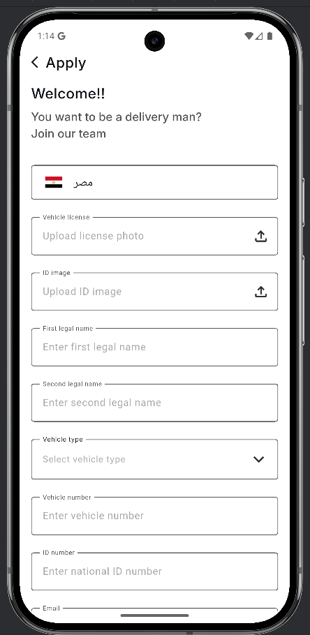
  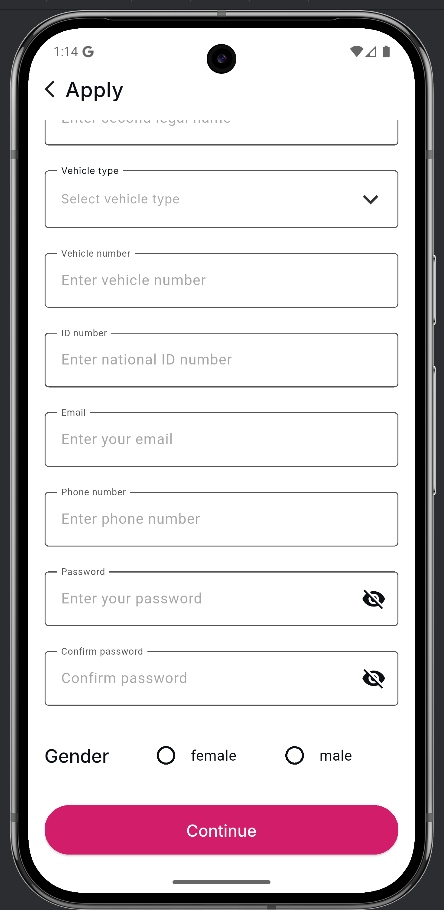
  
  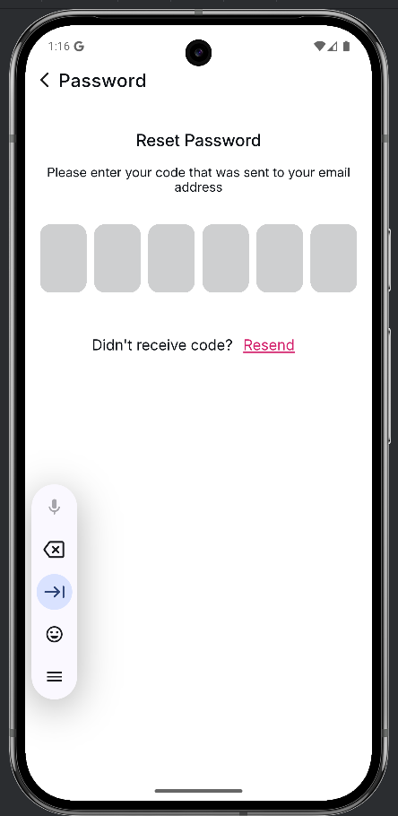
  
  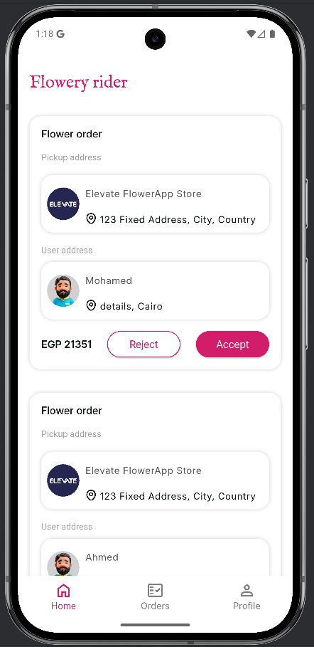
  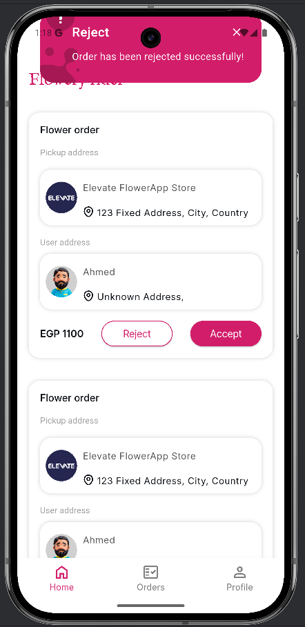
  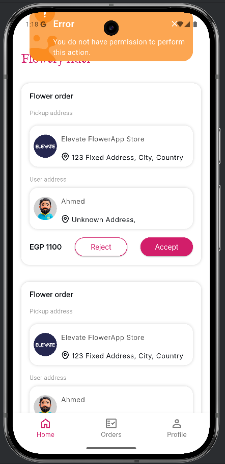
  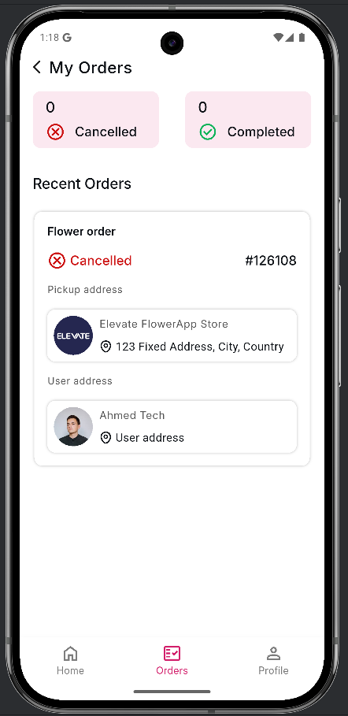
  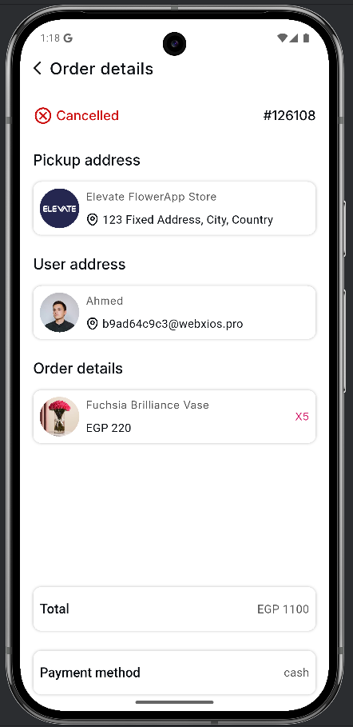
  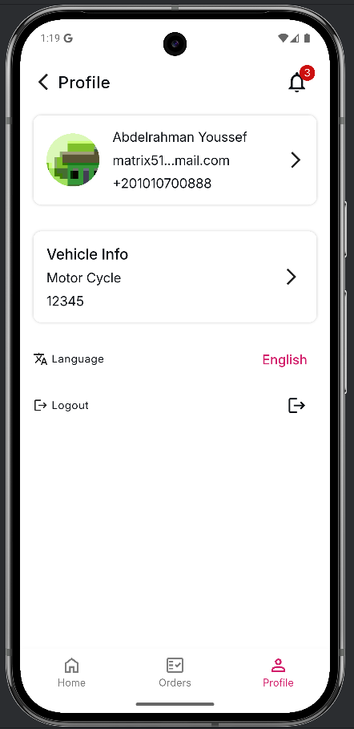
  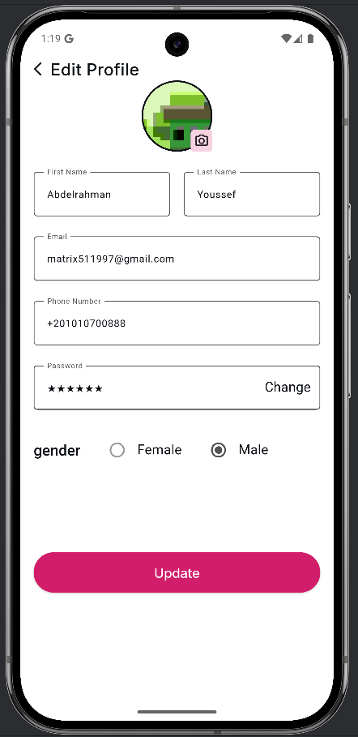
  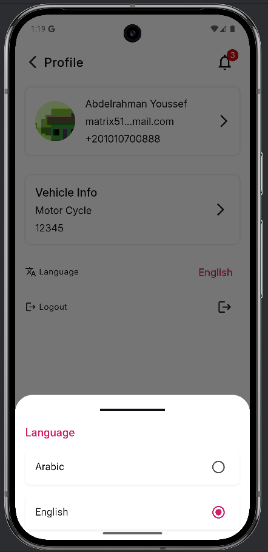
</p>


## 🚀 Getting Started

### Prerequisites
- [Flutter SDK](https://docs.flutter.dev/get-started/install) (>= 3.x)
- Android Studio / VSCode
- Emulator or physical device

### Installation

1. Clone the repository:
    ```bash
    git clone https://github.com/Aswani20/flowery-driver.git
    ```

2. Navigate to the project directory:
    ```bash
    cd flowery-driver
    ```

3. Install dependencies:
    ```bash
    flutter pub get
    ```

4. Run the app:
    ```bash
    flutter run
    ```

### Testing

1. Run the app:

    ```bash
    flutter test
    ```

## 🤝 Contributing

- Fork the repo

- Create your feature branch (git checkout -b feature/YourFeature)

- Commit changes (git commit -m 'Add some feature')

- Push to branch (git push origin feature/YourFeature)

- Open a Pull Request

## 📜 License

Distributed under the MIT License. See LICENSE for more information.


## 👨‍💻 Author

1. Abdelrahman Youssef
2. Moataz Ebrahim
3. Wasim Ghonim
4. Yassen Ahmed


## Folder Structure

```text
lib/
│
├── core/
│   ├── aiLayer/
│   ├── classes/
│   ├── config/
│   ├── di/
│   ├── enum/
│   ├── errors/
│   ├── functions/
│   ├── helpers/
│   ├── localization/
│   ├── models/
│   ├── services/
│   ├── utils/
│   └── widgets/
│
├── features/
│   ├── auth/
│   ├── mainLayout/
│   ├── orderDetails/
│   └── resetPassword/
│
├── firebase_options.dart
└── main.dart
